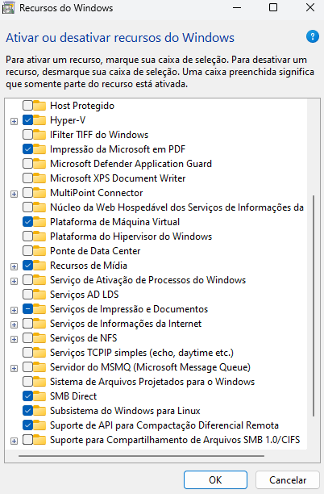

Escolhi o CUDA para a instalação, pois a GPU do meu computador é NVIDIA e possui suporte a essa tecnologia.

## Primeira tentativa

Comecei tentando instalar o CUDA no Windows. E não deu certo. Consegui instalar o `CUDA Tool-kit` e consegui rodar o comando `nvcc`, porém, quando tento compilar o programa, recebo o erro :

```powershell
nvcc error : 'cudafe++' died with status 0xC0000005 (ACCESS_VIOLATION)
```

### Segunda tentativa

Para a minha segunda tentativa, escolhi utilizar o `WSL`. A partir do passo a passo a seguir, consegui configurar o ambiente corretamente.

1. Habilitar `WSL` e `Hyper-V` no Windows



2. Instalar o `Ubuntu` no WSL

3. Atualizar os pacotes do sistema

```bash
sudo apt update
sudo apt upgrade
```

2. Instalar os pacotes `wget`, `curl`, `git`

```bash
sudo apt install wget curl git
```

3. Baixar o `CUDA` para `Ubuntu` a partir do [site da NVIDIA](https://developer.nvidia.com/cuda-downloads)

```bash
wget https://developer.download.nvidia.com/compute/cuda/12.6.2/local_installers/cuda_12.6.2_560.35.03_linux.run
sudo sh cuda_12.6.2_560.35.03_linux.run
```

4. Adicionar o compilador do `CUDA` nas variáveis de ambiente

- Edite o arquivo de configuração do `shell`

```bash
vim ~/.bashrc
```

- Adicione as linhas a seguir no arquivo e salve

```bash
export PATH=/usr/local/cuda-12.6/bin${PATH:+:${PATH}}
export LD_LIBRARY_PATH=${LD_LIBRARY_PATH}:/usr/local/cuda/lib64
```

- Atualize a configuração

```bash
source ~/.bashrc
```

5. Instalar o pacote `nvidia-utils`

```bash
sudo apt install nvidia-utils-545
```

6. Verificar a versão do compilador e da GPU

```bash
nvcc --version
nvidia-smi
```

7. Compilar o programa em `CUDA` e executá-lo

```bash
nvcc -o main main.cu
./main
```
